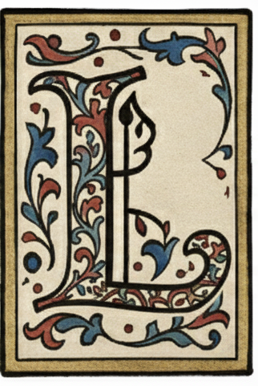

<div align="center">
  

</div>

<div align="center">


[](https://2025.aclweb.org/)
[]()
[](https://huggingface.co/datasets/sapienzanlp/LiteraryQA)
[](https://creativecommons.org/licenses/by-nc/4.0/)
</div>


##  Description
This repository contains the official code for the EMNLP 2025 main conference paper: [<span style="font-variant: small-caps;">LiteraryQA</span>: Towards Effective Evaluation of Long-document Narrative QA]() by [Tommaso Bonomo](https://www.linkedin.com/in/tommaso-bonomo/)\*, [Luca Gioffré](https://www.linkedin.com/in/luca-gioffre/)\* and [Roberto Navigli](https://www.linkedin.com/in/robertonavigli/).
The dataset is available at this [🤗 Hugging Face dataset](https://huggingface.co/datasets/sapienzanlp/LiteraryQA).

## Setup 

Clone the repository and create a Python virtual environment and install the requirements. 
We recommend using [uv](https://docs.astral.sh/uv/guides/install-python/#getting-started) as package manager.
```bash
git clone https://github.com/sapienzanlp/LiteraryQA.git
uv sync
```

## <span style="font-variant: small-caps;">LiteraryQA</span> Data

### Local Download
To obtain the <span style="font-variant: small-caps;">LiteraryQA</span> dataset, first download the original books from [Project Gutenberg](https://www.gutenberg.org/ebooks/), then run the cleaning step:
```bash
./scripts/download_books.sh test # dash-separated list of the data splits
./scripts/clean_books.sh
```
The dataset will be saved to the default directory `data/`.

You can also access the dataset through [🤗 Hugging Face](https://huggingface.co/datasets/sapienzanlp/LiteraryQA).

### Data format
<span style="font-variant: small-caps;">LiteraryQA</span> is a filtered and improved version of [NarrativeQA](https://arxiv.org/abs/1712.07040). 
Each book contains the following data:

```json
{
    "document_id": "9562ea781e95c048df96f528a2a8272721cde3a7", # (str) i.e., NarrativeQA ID of the document 
    "gutenberg_id": "32154", # (str) i.e., key of the book in Project Gutenberg
    "split": "test", # (str) i.e., in which split the book is found
    "title": "The Variable Man",
    "text": "THE VARIABLE MAN\nBY PHILIP K. DICK\nILLUSTRATED BY EBEL\nHe fixed things—clocks, refrigerators, vidsen...",
    "summary": "The Terran system is growing and expanding all the time. But an old and corrupt Centaurian Empire is...",
    "qas": [
        {
            "question": "Why is Terra at war with Proxima Centauri?",
            "answers": [
                "Because they will not give Terra the room to expand their empire.",
                "The Centaurian Empire will not let humans from Terra grow out of their current empire."
                ],
            "is_question_modified": False,
            "is_answer_modified": [False, False],
        }, 
        ...
    ]
    "metadata": {
        "publication_date": "-",
        "genre_tags": "novella;literary work;sci-fi;",
        "text_urls": "http://www.gutenberg.org/ebooks/32154.txt.utf-8", 
        "summary_urls": "http://en.wikipedia.org/wiki/The_Variable_Man"
    }
}
```

## Citation
This work has been published at EMNLP 2025 (main conference). If you use any artifact, please cite our paper as follows:

```bibtex
@inproceedings{bonomo-etal-2025-literaryqa,
    title = "LiteraryQA: Towards Effective Evaluation of Long-document Narrative QA",
    author = "Bonomo, Tommaso  and
      Gioffré, Luca  and
      Navigli, Roberto",
    editor = "",
    booktitle = "Proceedings of the ...",
    month = "11",
    year = "2025",
    address = "Suzhou, China",
    publisher = "Empirical Methods for Natural Language Processing",
    url = "",
    pages = "",
    ISBN = "",
    }
```


## License

The data and software are licensed under [Creative Commons Attribution-NonCommercial-ShareAlike 4.0](https://creativecommons.org/licenses/by-nc-sa/4.0/).
